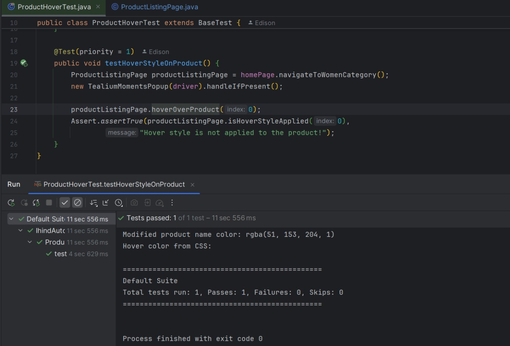
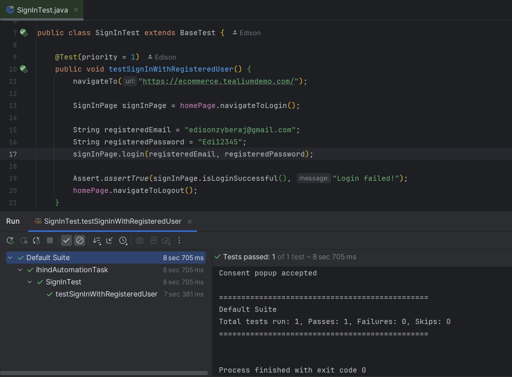
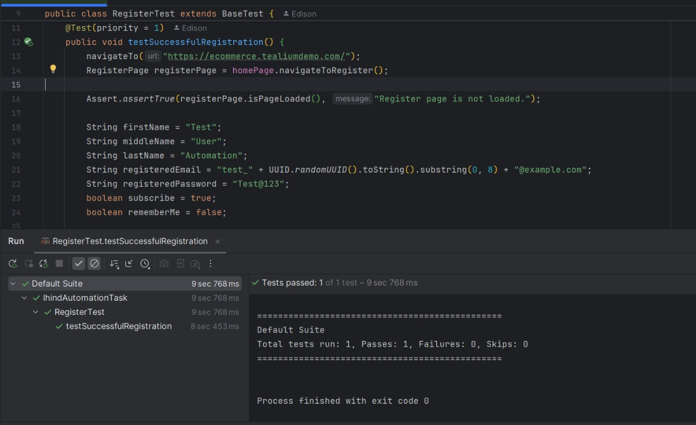
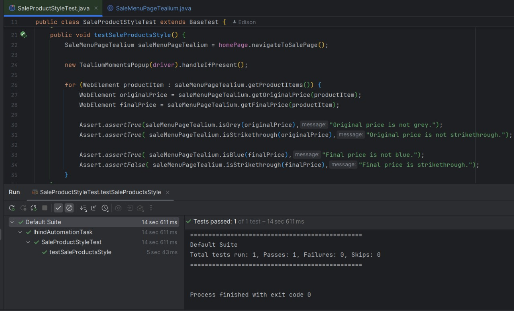
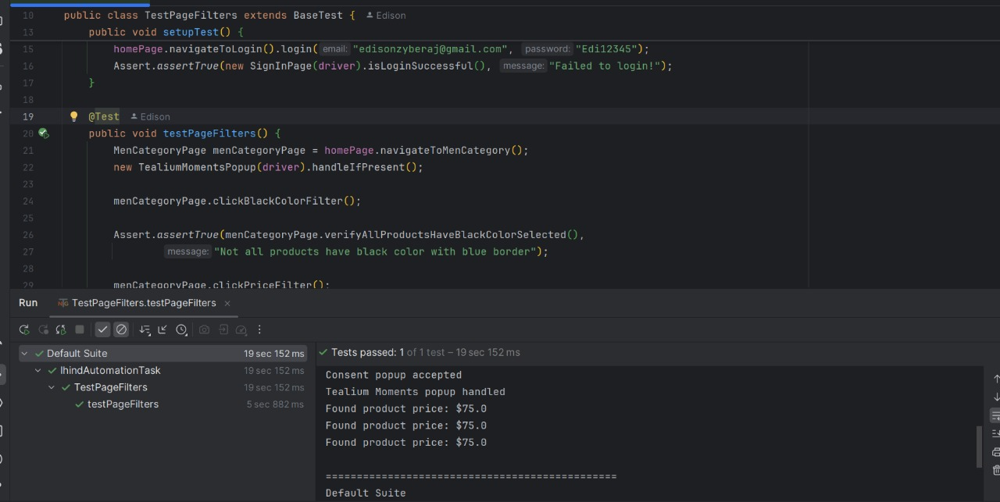
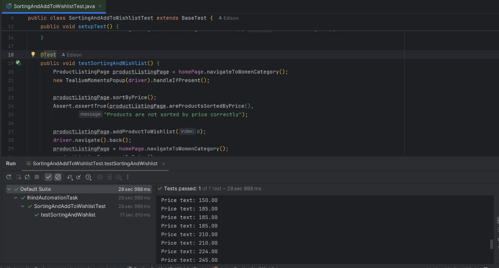
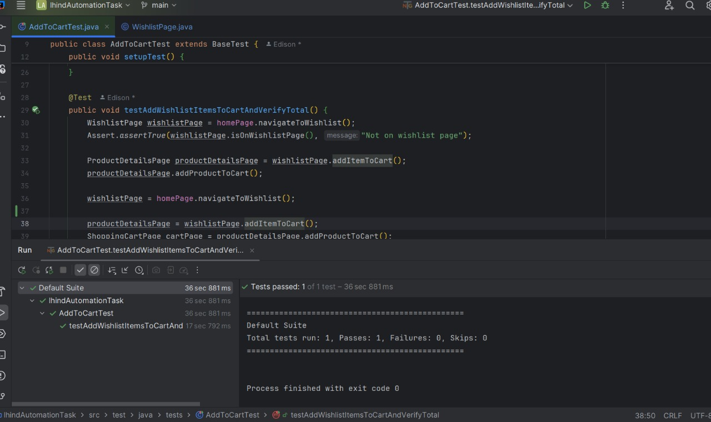
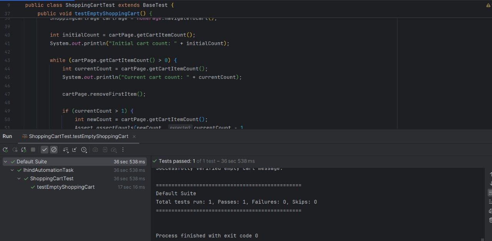

# E-commerce Testing Framework

This project is an automated testing framework for the Tealium E-commerce demo website using Selenium WebDriver, Java, and TestNG.

## Project Structure

```
├── src
│   ├── main
│   │   ├── java
│   │   │   ├── pages         # Page Object Model classes
│   │   │   └── utils         # Utility classes
│   │   └── resources         # Drivers and other resources
│   └── test
│       └── java
│           └── tests         # Test classes
└── pom.xml                   # Maven dependencies
```

## Page Object Model

The framework implements the Page Object Model (POM) design pattern:

- `BasePage`: Abstract base class with common methods
- Various page classes (`HomePage`, `ProductListingPage`, etc.) that extend `BasePage`
- Each page class encapsulates the page elements and actions

## Test Cases

The framework includes the following test cases:

1. **RegisterTest**: Tests user registration functionality
2. **SignInTest**: Tests user login functionality
3. **ProductHoverTest**: Verifies hover effects on product items
4. **SortingAndAddToWishlistTest**: Tests product sorting and wishlist functionality
5. **SaleProductStyleTest**: Verifies sale product styling (strikethrough prices, color)
6. **TestPageFilters**: Tests product filtering functionality
7. **AddToCartTest**: Tests adding products to cart
8. **ShoppingCartTest**: Tests shopping cart functionality

## Utilities

- `JavaScriptUtils`: Helper methods for JavaScript execution
- `ConsentPopup`: Handles consent popups that might appear
- `TealiumMomentsPopup`: Handles Tealium Moments popups
- `ExtentReportManager`: Generates test reports
- `TakeFailScreenshot`: Takes screenshots on test failure

## Dependencies

The main dependencies include:

- Selenium WebDriver
- TestNG
- ExtentReports

## Getting Started

1. Clone the repository
2. Ensure you have JDK 8+ installed
3. Update the ChromeDriver path in `BaseTest.java` if needed
4. Run the tests using TestNG

## Test Results

Below are the screenshots of the test execution results:


















Each test is independent and follows a clear arrange-act-assert pattern with appropriate preconditions set up in `@BeforeMethod` methods.